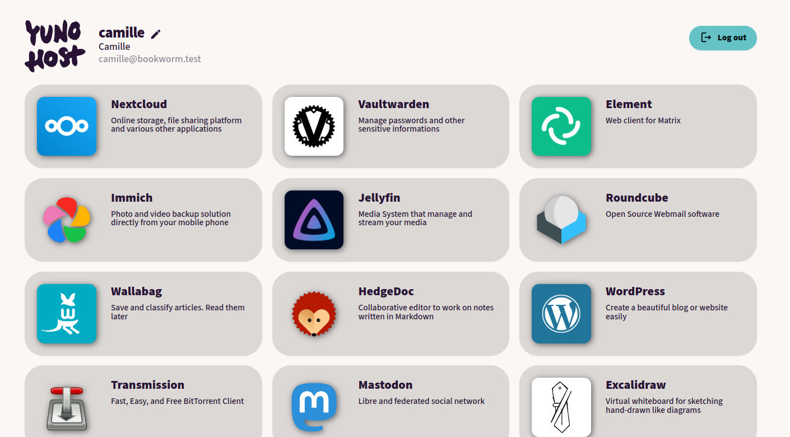
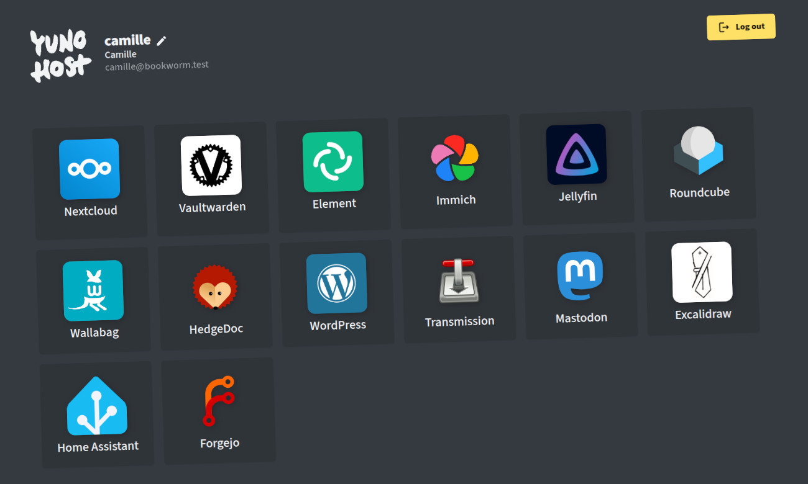

<h1 align="center">YunoHost User Portal</h1>

  

[YunoHost](https://yunohost.org) user portal ([VueJS/Nuxt](https://nuxt.com/) client for the portal API).

This client is a part of the YunoHost project, and can not be installed directly.  
Please visit the YunoHost website for [installation instructions](https://yunohost.org/install).

## Issues

- [Please report issues on YunoHost bugtracker](https://github.com/YunoHost/issues).

## Translation

You can help translate Yunohost-Portal on our [translation platform](https://translate.yunohost.org/engage/yunohost/?utm_source=widget)

## Develop (using Docker)

- Install Docker
    - cf [these instructions](https://docs.docker.com/engine/install/debian/#set-up-the-repository) to add Docker's apt repository
    - and then `apt update && apt install docker-ce`
- Install Docker-compose
    - `pip3 install docker-compose`
- Inside your Yunohost LXC/ynh-dev/???, make sure the new `yunohost-portal-api` service is running and corresponding route is in nginx config
- **Important**: Inside your Yunohost machine, enable CORS from your dev front-end:
    - `echo "http://127.0.0.1:3000" > /etc/yunohost/.portal-api-allowed-cors-origins`
    - `systemctl restart yunohost-portal-api`
- Back to Yunohost-portal's repo: define what's the IP / domain of your test LXC where the API lives (here, for example, `yolo.test` which is define in `/etc/hosts`):
    - `echo 'NUXT_PUBLIC_API_IP=yolo.test' > .env`
- `docker-compose up -d` : will rebuild the docker on the first time, then launch it
- Check `docker-compose logs -f` : should show that nuxt/nitro is building stuff then serving it on port 3000
- Access `http://127.0.0.1:3000` from your browser

## Develop (manual / directly on your host machine)

- Basically the same stuff, but ignore docker-related steps. Instead:
- You'll need NodeJS 18.14 (or higher) and `yarn`
- Run `yarn install`
- Run `yarn dev`
